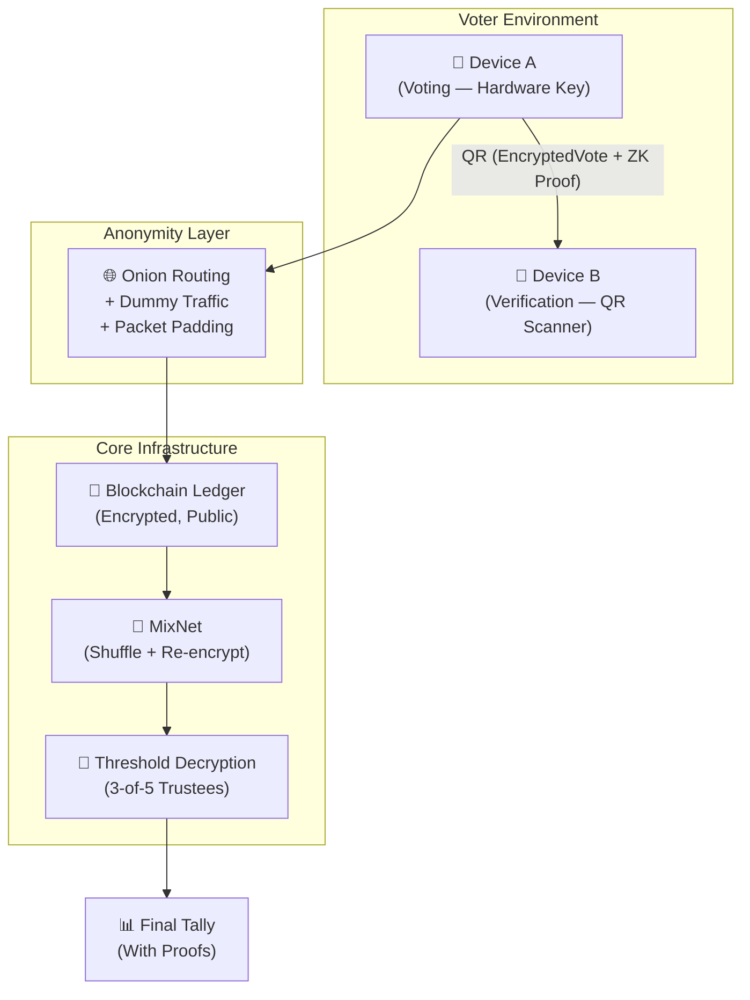

# Atom Voting

> A nation-state resistant, end-to-end verifiable, coercion-resistant cryptographic Internet voting system.

[](https://github.com/monickverma/atom-voting/actions/workflows/ci.yml)
[](LICENSE)
[](https://www.python.org/downloads/)
[](CONTRIBUTING.md)

---

## Problem

Existing Internet voting systems — including Estonia's i-Voting, Helios, and blockchain-based proposals — fail to simultaneously satisfy:

| Threat | Existing Gap |
|--------|-------------|
| Malware on voter devices | Vote silently manipulated before encryption |
| Credential theft | Stolen passwords used to impersonate voters |
| Insider attacks | Election staff can manipulate votes or tally |
| Coercion / vote-selling | Voter forced to prove how they voted |
| Lack of E2E verifiability | No cryptographic proof vote was counted correctly |
| Traffic analysis | Nation-state observers correlate *who* voted *when* |

No production system addresses all of these simultaneously. This project does.

---

## Solution

**Atom Voting** is an open-source reference implementation of a cryptographic remote voting protocol that integrates:

- 🔐 **Hardware-bound identity** — FIDO2/TPM, no passwords to steal or phish
- 🔢 **Code voting** — voter enters a numeric code, not a name; malware sees nothing meaningful
- 📱 **Dual-device verification** — two independent devices must agree before a vote is cast
- 🎭 **Fake credentials (JCJ scheme)** — coercers cannot distinguish a real vote from a decoy
- 🔁 **Re-voting** — override any coerced or malware-affected vote at any time
- 🔍 **Challenge / Spoil ballots** — probabilistic audit mechanism to catch manipulation
- 🔗 **Immutable blockchain ledger** — publicly auditable, tamper-evident vote log
- 🔀 **MixNet anonymisation** — shuffles and re-encrypts all votes before decryption
- 🔑 **Threshold cryptography** — 3-of-5 trustees must cooperate to decrypt; no single point of trust
- 🌐 **Traffic analysis defence** — anonymity routing, constant dummy traffic, packet padding

> **Security level: Near theoretical maximum for remote Internet voting, as of current academic understanding.**

---

## Architecture Overview



For full C4 diagrams, sequence flows, and component breakdown, see [docs/architecture.md](docs/architecture.md).

---

## Quick Start

```bash
git clone https://github.com/monickverma/atom-voting
cd atom-voting
cp .env.example .env
make install
make dev
```

API: `http://localhost:8000` · Interactive docs: `http://localhost:8000/docs`

---

## Features

### v1.0 — Core Protocol (Current)
- [x] Cryptographic ballot model (ElGamal encryption, ZK proof stubs)
- [x] Re-voting with `RevotePointer` chain
- [x] Fake credential flag (JCJ scheme) — tally discards fake votes
- [x] Challenge / Spoil audit mechanism
- [x] REST API versioned at `/api/v1/`
- [x] Immutable vote log (append-only ledger)
- [x] Docker Compose local development
- [x] CI pipeline (lint + type check + tests + coverage)

### v1.1 — Contributions Welcome 🙌
- [ ] ElGamal homomorphic encryption implementation (#5) — `good first issue`
- [ ] ZK proof generation and verification (#7) — `good first issue`
- [ ] MixNet shuffle layer (#9) — `intermediate`
- [ ] Threshold decryption ceremony (#11) — `advanced`
- [ ] Integration tests for full vote lifecycle (#18) — `good first issue`

### v2.0 — Future
- [ ] Hardware key (FIDO2/WebAuthn) authentication
- [ ] Dual-device QR verification flow
- [ ] On-chain Merkle-tree vote ledger
- [ ] Traffic anonymisation layer
- [ ] Full trustee key ceremony UI

---

## System Comparisons

| System | E2E Verifiable | Coercion Resistant | Distributed Trust | Hardware Identity | Traffic Protection |
|--------|:-:|:-:|:-:|:-:|:-:|
| Estonia i-Voting | ❌ | ❌ | ❌ | Partial | ❌ |
| Helios | ✅ | ❌ | Partial | ❌ | ❌ |
| **Atom Voting** | ✅ | ✅ | ✅ | ✅ | ✅ |

---

## Academic Foundations

| Component | Source Scheme |
|-----------|--------------|
| End-to-end verifiability | Helios, Belenios, STAR-Vote |
| Code voting | Prêt-à-Voter |
| Fake credentials | JCJ (Juels-Catalano-Jakobsson) |
| MixNet anonymity | Chaum MixNets, Verificatum |
| Threshold cryptography | Shamir Secret Sharing |
| Hardware identity | FIDO2 / WebAuthn / TPM |
| Anonymity routing | Tor onion routing |

---

## Tech Stack

| Layer | Technology |
|-------|-----------|
| API | FastAPI (Python 3.12) |
| Encryption | ElGamal / Paillier (homomorphic) |
| Persistence | PostgreSQL + append-only vote ledger |
| Cache / Rate limiting | Redis |
| Containerisation | Docker + Docker Compose |
| CI/CD | GitHub Actions |

---

## Contributing

We welcome contributions at all skill levels — from fixing docs to implementing ZK proofs.

Read [CONTRIBUTING.md](CONTRIBUTING.md) for setup and workflow.  
Browse issues tagged `difficulty: good first issue` to start.  
See [docs/architecture.md](docs/architecture.md) for deep system design.  
Ask questions in [GitHub Discussions](https://github.com/monickverma/atom-voting/discussions).

---

## Security

This project deals with cryptographic voting primitives. Please report vulnerabilities via [SECURITY.md](SECURITY.md) — **never** via public issues.

---

## License

[MIT](LICENSE) © 2026 monickverma
