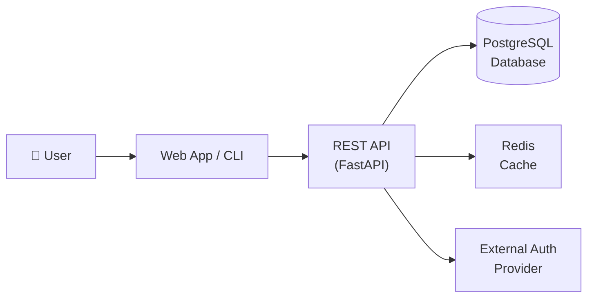

# Atom Voting

> A transparent, open-source decentralized voting platform built for hackathons and community governance.

[](https://github.com/monickverma/atom-voting/actions/workflows/ci.yml)
[](LICENSE)
[](https://www.python.org/downloads/)
[](CONTRIBUTING.md)

---

## Problem

Existing voting systems are opaque, centralized, and difficult to audit. Communities running hackathons, DAOs, or open-source governance have no lightweight, self-hostable tool they can trust, fork, and contribute to.

---

## Solution

**Atom Voting** provides a transparent, contribution-ready voting API and CLI. Every vote is logged, auditable, and extensible. Teams can self-host it in minutes and contributors can add new tallying strategies, frontends, or integrations without touching core logic.

---

## Demo

> _Screenshot / GIF of the running application goes here._


---

## Architecture Overview



For the full architecture breakdown, container diagrams, and ADRs, see [docs/architecture.md](docs/architecture.md).

---

## Quick Start

```bash
git clone https://github.com/monickverma/atom-voting
cd atom-voting
cp .env.example .env          # configure your environment
make install                   # install all dependencies
make dev                       # start local development server
```

The API will be available at `http://localhost:8000`.  
Interactive docs: `http://localhost:8000/docs`

---

## Features

### v1.0 (Current)
- [x] REST API with versioned endpoints (`/api/v1/`)
- [x] Create and manage voting polls
- [x] Cast and tally votes
- [x] Docker Compose local development
- [x] CLI interface

### Coming Soon
- [ ] Rate limiting and anti-spam (#15)
- [ ] Batch voting endpoint (#12) — _good first issue_
- [ ] Integration tests (#18) — _good first issue_
- [ ] WebSocket real-time results (#20)
- [ ] Plugin system for custom tallying strategies

---

## Tech Stack

| Layer | Technology |
|---|---|
| API | FastAPI (Python 3.12) |
| Database | PostgreSQL |
| Cache | Redis |
| Containerization | Docker + Docker Compose |
| CI/CD | GitHub Actions |

---

## Contributing

We welcome contributions of all kinds — code, docs, tests, and ideas.

Please read [CONTRIBUTING.md](CONTRIBUTING.md) to get started.  
Browse [open issues](https://github.com/monickverma/atom-voting/issues) for tasks labeled `good first issue`.

For architectural questions see [docs/architecture.md](docs/architecture.md).  
For discussion and questions use [GitHub Discussions](https://github.com/monickverma/atom-voting/discussions).

---

## Code of Conduct

This project follows the [Contributor Covenant](CODE_OF_CONDUCT.md). By participating you agree to uphold a welcoming, respectful community.

---

## Security

To report a vulnerability, please see [SECURITY.md](SECURITY.md). Do **not** open a public GitHub issue.

---

## License

[MIT](LICENSE) © 2026 monickverma
