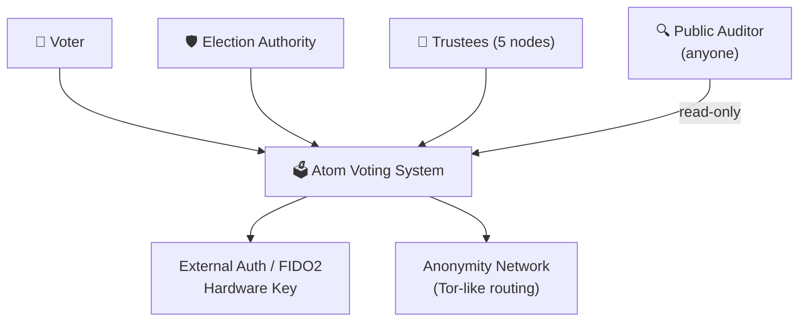
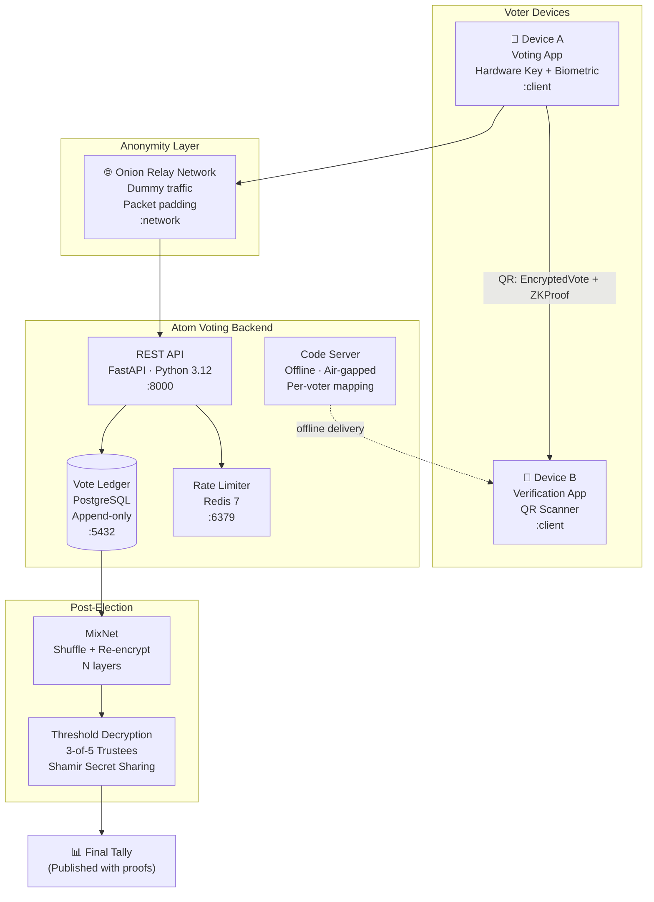
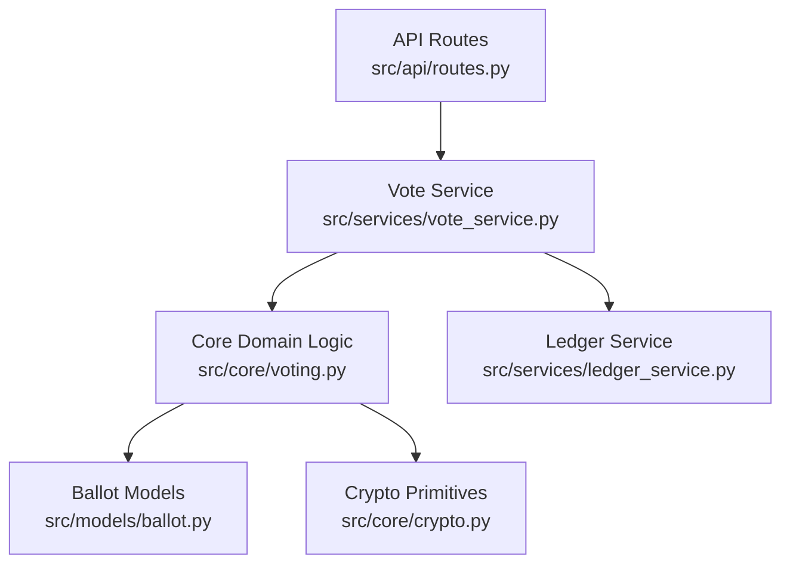
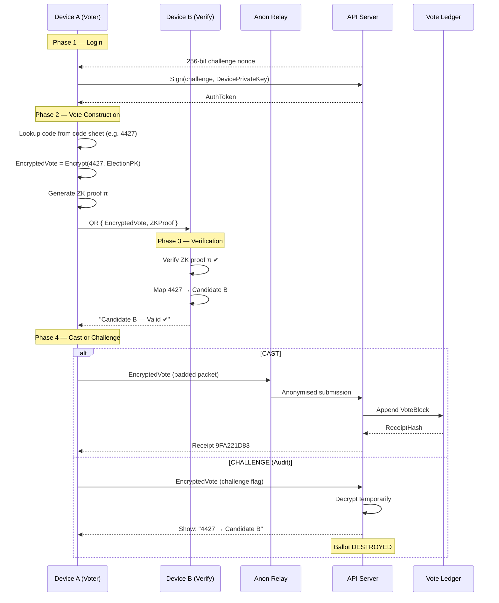
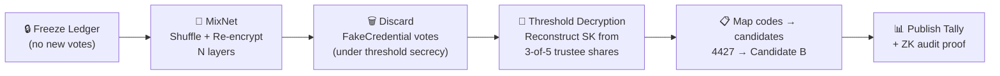

# Architecture

## System Overview

Atom Voting is a cryptographic remote voting system designed to be **nation-state resistant**, **end-to-end verifiable**, and **coercion-resistant**. It integrates hardware-bound identity, code voting, dual-device verification, MixNet anonymisation, and threshold cryptography to reach near-theoretical-maximum security for Internet voting.

---

## Level 1 — System Context



---

## Level 2 — Container Architecture



| Container | Technology | Responsibility |
|-----------|-----------|----------------|
| Device A | Mobile App | Hardware key auth, code entry, encryption, QR gen |
| Device B | Mobile App | QR scan, ZK proof verification, candidate mapping check |
| Onion Relay | Tor-like network | Traffic anonymisation, dummy traffic, packet padding |
| REST API | FastAPI (Python 3.12) | Ballot submission, receipt, challenge/spoil endpoints |
| Vote Ledger | PostgreSQL (append-only) | Immutable, publicly auditable encrypted vote log |
| Rate Limiter | Redis 7 | Per-credential rate limiting, session state |
| Code Server | Air-gapped system | Per-voter numeric → candidate mapping (offline) |
| MixNet | Verificatum-style | Shuffle + re-encrypt all ciphertexts before tally |
| Threshold Dec. | Shamir Secret Sharing | Distributed key reconstruction (3-of-5 trustees) |

---

## Level 3 — Component Architecture (API Container)



| Component | Location | Responsibility |
|-----------|----------|----------------|
| API Routes | `src/api/routes.py` | HTTP adapter — request/response mapping only |
| Vote Service | `src/services/vote_service.py` | Use case orchestration |
| Ledger Service | `src/services/ledger_service.py` | Append-only vote storage |
| Core Logic | `src/core/voting.py` | Pure domain: validate, revote chain, JCJ tally filter |
| Crypto Primitives | `src/core/crypto.py` | ElGamal encryption, ZK proof, MixNet interfaces |
| Ballot Models | `src/models/ballot.py` | `EncryptedBallot`, `Credential`, `VoteBlock` types |

### Dependency Direction

```
API Routes → Services → Core → Models
                  ↓
            Crypto Primitives
```

Core domain logic has **zero** FastAPI or database imports. Fully testable in isolation.

---

## Complete Voting Workflow



---

## Blockchain / Vote Ledger Data Model

| Field | Description |
|-------|-------------|
| `VoteID` | `hash(EncryptedVote)` — unique, deterministic |
| `Ciphertext` | ElGamal ciphertext `(c1, c2)` |
| `CredentialHash` | `hash(RC74291)` or `hash(FC74291)` — indistinguishable |
| `Timestamp` | UTC submission time |
| `RevotePointer` | Link to previous `VoteID` (null if first vote) |
| `ZKProof` | Zero-knowledge validity proof `π` |
| `ReceiptHash` | Voter's verifiable receipt |

**Not stored:** voter identity, candidate names, decrypted votes.

---

## Post-Election Tally Flow



---

## Security Properties

| Property | Mechanism |
|----------|-----------|
| **E2E Verifiable** | ZK proofs + public ledger + receipt checking |
| **Coercion-Resistant** | Fake credentials (JCJ) + re-voting within voting window |
| **Malware-Resilient** | Code voting + dual-device independent verification |
| **Traffic-Anonymous** | Onion routing + dummy traffic + uniform packet size |
| **Distributed Trust** | Threshold cryptography — no single decryption key holder |
| **Anonymous by Design** | MixNet breaks credential→vote link before decryption |
| **Hardware-Bound Identity** | TPM/Secure Enclave — no copyable credentials |
| **Publicly Auditable** | Open-source builds + ZK proofs + public ledger |

---

## Key Design Decisions

See [docs/decisions/](decisions/) for full Architecture Decision Records.

| Decision | Outcome | ADR |
|----------|---------|-----|
| Primary database | PostgreSQL | [ADR-001](decisions/001-database-choice.md) |
| Encryption scheme | ElGamal homomorphic | [ADR-002](decisions/002-encryption-scheme.md) |
| Anonymisation layer | MixNet (not ring signatures) | [ADR-003](decisions/003-mixnet-vs-ring-signatures.md) |

---

## Known Limitations (Honest Assessment)

| Limitation | Notes |
|-----------|-------|
| Both devices compromised | If both compromised AND voter never re-votes on clean device |
| Tor-like routing at national scale | Dedicated relay infrastructure needed; public Tor insufficient |
| Supervised coercion throughout voting window | Physical problem — not solvable by cryptography alone |
| TPM/Secure Enclave trust | Hardware-level backdoors remain an assumption |

> **Fundamental limit:** No system can guarantee voter intent capture on a fully compromised device without trusted hardware. This design pushes attack cost to near-theoretical maximum for Internet voting.
