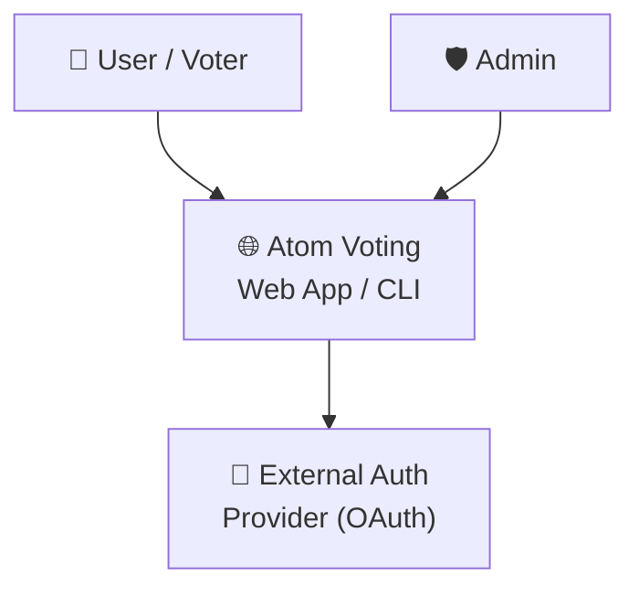
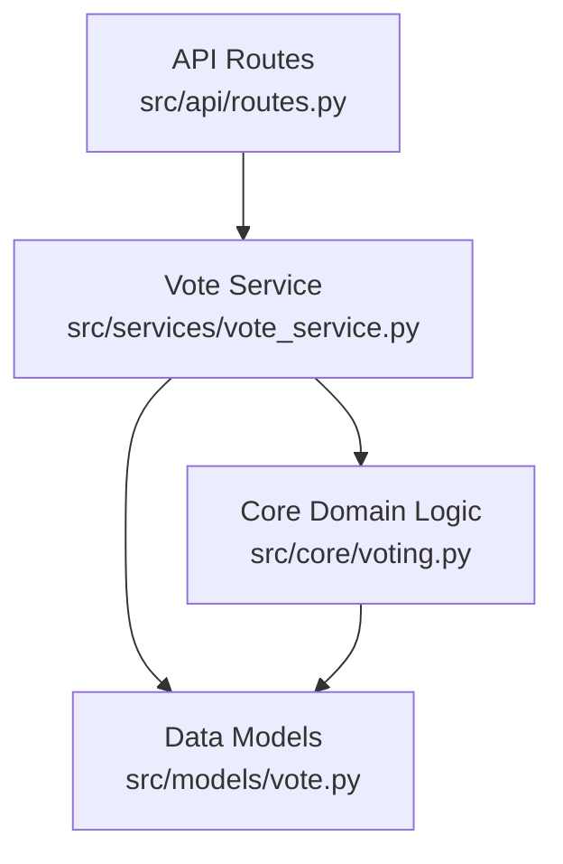
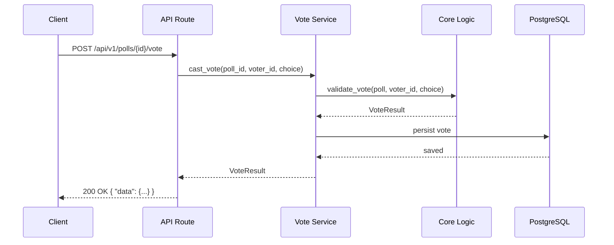

# Architecture

## System Overview

Atom Voting is a stateless REST API that manages voting polls. It runs as a containerised FastAPI service backed by PostgreSQL for persistence and Redis for caching and rate limiting. The core domain logic is fully decoupled from framework and I/O concerns, enabling easy testing and extension.

---

## Level 1 — System Context



---

## Level 2 — Container Architecture

```mermaid
graph TB
    subgraph "Atom Voting System"
        API["REST API\nFastAPI · Python 3.12\n:8000"]
        DB[("Primary Database\nPostgreSQL 15\n:5432")]
        Cache["Cache + Rate Limiter\nRedis 7\n:6379")]
    end

    Client["👤 Client\n(Browser / CLI / Mobile)"] --> API
    API --> DB
    API --> Cache
    API --> Auth["External Auth Provider\n(OAuth 2.0)"]
```

| Container | Technology | Responsibility |
|-----------|-----------|----------------|
| REST API | FastAPI (Python 3.12) | All business logic, request validation, auth |
| Database | PostgreSQL 15 | Persistent storage of polls and votes |
| Cache | Redis 7 | Response caching, rate limiting, session state |
| Auth | External OAuth provider | User identity (pluggable) |

---

## Level 3 — Component Architecture (API Container)



| Component | Location | Responsibility |
|-----------|----------|----------------|
| API Routes | `src/api/routes.py` | HTTP interface, request/response mapping |
| Vote Service | `src/services/vote_service.py` | Orchestrates use cases, calls core logic |
| Core Logic | `src/core/voting.py` | Pure domain logic — tally, validate, deduplicate |
| Models | `src/models/vote.py` | Pydantic schemas and domain types |
| Utils | `src/utils/helpers.py` | Shared utility functions |

### Dependency Direction

```
API Routes → Services → Core → Models
```

**Lower layers never import from higher layers.** Core logic has no FastAPI or database imports — it is fully testable in isolation.

---

## Data Flow — Casting a Vote



---

## Key Design Decisions

See [docs/decisions/](decisions/) for full Architecture Decision Records.

| Decision | Outcome |
|----------|---------|
| Database choice | PostgreSQL — [ADR-001](decisions/001-database-choice.md) |

---

## Security Considerations

- All routes require authentication (JWT via external provider)
- Votes are tied to a voter identity to prevent double voting
- Rate limiting enforced at Redis layer
- No secrets in codebase — all via environment variables

---

## Scalability Notes

- API is stateless — horizontally scalable behind a load balancer
- Database reads can be offloaded to read replicas
- Redis handles session state, so API instances share no memory state

---

## Known Limitations

- Currently supports English-language poll content only
- No real-time push (polling required for live results) — planned for v2.0
- Single region deployment — multi-region not yet implemented
